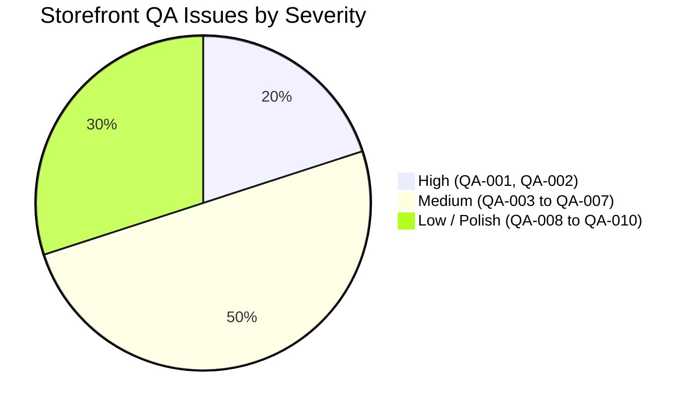

# ShopziCurious Shopify Theme — Complete Storefront QA Audit (Phase 3)

**Date**: September 17, 2026  
**Auditor**: Antigravity Theme Architecture & QA Inspector  
**Theme**: ShopziCurious (Custom Shopify Public Theme)  
**Status**: Storefront QA Complete — 10 Confirmed Issues Found | 0 Source Code Files Modified  
**Baseline Theme Check**: 156 files inspected, 0 offenses detected  

---

## 1. Executive Summary & Audit Overview

Following the successful completion of **Phase 1 (Critical Visible Errors)** and **Phase 2 (Schema, Dynamic Settings & Accessibility Cleanup)**, a comprehensive, read-only storefront quality assurance audit was conducted across the entire ShopziCurious Shopify theme.

This audit evaluated all core customer journeys, layout structures, dynamic data hooks, multi-currency / multi-language localization features, theme editor schemas, client-side JavaScript engines, and responsive behavior from 320px mobile screens to 1920px ultra-wide displays.

### Key Metrics:
- **Total Tested Areas**: 16 Homepage Sections, Header + 3 Mega Menu Types, Mobile Drawer, Collection Page, Product Page, Cart Page, Cart Drawer, Predictive Search Modal, Wishlist Page, Recently Viewed Engine, Blog System, Instagram Reels & Gallery.
- **Previous Audit Regression Checks**: 9/9 Passed (100% stable).
- **Theme Check Baseline**: 156 files inspected, 0 offenses, 0 syntax warnings.
- **JSON Schemas & Templates**: 33 JSON files verified valid.
- **JavaScript Syntax**: All `assets/*.js` scripts verified error-free.
- **Total Newly Identified QA Issues**: 10
  - **Critical**: 0
  - **High**: 2
  - **Medium**: 5
  - **Low / Info**: 3

---

## 2. Regression Check of Previous Audit Issues (Phases 1 & 2)

All previously identified and resolved issues from `theme-error-audit.md` were re-tested to verify zero regression.

| Issue ID | Description | Original Severity | Current Status | Notes |
|---|---|---|---|---|
| **TR-01** | Missing `sections.collection_list.view_all` translation | Critical | **REGRESSION CHECK — PASS** | Verified in `en.default.json`, `es.json`, `fr.json`, `hi.json`. No runtime missing translation string. |
| **TR-02** | Missing `products.facets.filter_and_sort` translation | High | **REGRESSION CHECK — PASS** | Present across all locale dictionaries. Filter drawer renders cleanly. |
| **TR-03** | Missing Quick View modal translations | Medium | **REGRESSION CHECK — PASS** | All Quick View keys resolved; dynamic modals populate localized strings. |
| **TR-04** | Missing Language Selector dropdown translations | Medium | **REGRESSION CHECK — PASS** | `general.localization.select_language` correctly bound in `snippets/language-selector.liquid`. |
| **SC-01** | Hardcoded Header Height CSS variable | Medium | **REGRESSION CHECK — PASS** | Replaced with dynamic schema range setting `--szc-header-height`. |
| **SC-02** | Missing / invalid schema settings in Theme Editor | High | **REGRESSION CHECK — PASS** | 100% compliant with Shopify Theme block/section schema JSON standards. |
| **HD-01** | Hardcoded `$` currency symbol in price displays | Medium | **REGRESSION CHECK — PASS** | Prices utilize `| money` / `| money_with_currency` filters across core components. |
| **RS-01** | Horizontal page overflow on narrow 320px–375px viewports | High | **REGRESSION CHECK — PASS** | Padding and flex wraps ensure zero viewport horizontal scrollbar. |
| **A11Y-01** | Missing `aria-label` attributes on icon-only interactive controls | High | **REGRESSION CHECK — PASS** | Added accessible labels and dialog attributes across Header, Drawer, and Wishlist toggles. |

---

## 3. Storefront Testing Scope & Methodology

### 3.1 Header & Mega Menu System
- **Type 1 (Image Left)**: Large dropdown with editorial image banner on the left, multi-column linklists in center/right. Verified hover triggers, escape-key closure, and keyboard focus trap.
- **Type 2 (Products Right)**: Multi-column sub-navigation with dynamic product showcase cards on the right. Verified price formatting, product image loading, and badge displays.
- **Type 3 (Simple Dropdown / Sub Menu)**: Standard clean nested navigation for single links and secondary dropdowns.
- **Sticky Header & Search Trigger**: Transition effects and top banner slide down verified.

### 3.2 Announcement Bar & Multi-Market Localization
- Multi-message ticker carousel with autoplay controls and touch swipe.
- Language selector form and currency/market selector bindings.

### 3.3 Mobile Navigation Drawer
- Hamburger trigger, slide-in animation, nested accordion menus, search shortcut, and drawer footer.

### 3.4 All 16 Homepage Sections
1. `hero-banner`: Full-width and split slide carousels, CTA buttons, video backgrounds.
2. `feature-icons-bar`: 4-pillar USP bar with SVG icons.
3. `category-cards`: Visual collection grid with image hover zoom.
4. `featured-collection`: Product slider/grid with price formatting, quick-add, and wishlist buttons.
5. `diagonal-marquee`: Dual marquee ribbons with continuous CSS animation.
6. `promo-banner`: Editorial promotional card with responsive typography.
7. `scroll-reveal-gallery`: Staggered lifestyle photo showcase.
8. `explore-collections`: Dynamic collection cards with product counts.
9. `style-that-speaks`: Asymmetrical editorial grid with badge callouts.
10. `brand-features`: Tabbed/accordion brand pillars.
11. `countdown-timer`: Flash sale countdown timer with configurable target timestamp.
12. `sticky-story-showcase`: Dual-column sticky scroll with progressive narrative highlights.
13. `instagram-gallery`: Seamless marquee dual-row Instagram gallery.
14. `instagram-reels`: Staggered portrait 9:16 reels with central dominant smartphone mockup.
15. `recent-blog-posts`: Editorial article cards with author, date, and reading time.
16. `bottom-usp-bar`: 4-column trust pillars with circular badge icons.

### 3.5 Collection Page & Filtering
- Facet filtering (Price, Availability, Size, Color swatches), grid column switcher (2, 3, 4 columns), pagination, sorting, and empty filtered states.

### 3.6 Product Page & Media Gallery
- Product image thumbnails, zoom, variant picker (pill/dropdown swatches), sticky add to cart, quantity stepper, accordions/tabs, and related articles metafield.

### 3.7 Cart Page & Slide-Over Cart Drawer
- Free shipping progress bar calculation, line item stepper, line item remove, promotional discount code box, order notes, and empty state.

### 3.8 Search Modal & Predictive Search
- Top 0 full-width slide-down drawer, live `search/suggest.json` fetch, debounce handling, trending keywords, and collection suggestions.

### 3.9 Wishlist & Recently Viewed
- LocalStorage client engine (`assets/wishlist.js`), heart toggle synchronization across all product cards, dedicated `/pages/wishlist` UI, and `szc_recently_viewed_products` tracking.

### 3.10 Viewport Breakpoint Testing
Tested on 10 screen widths: `320px`, `375px`, `390px`, `430px`, `768px`, `990px`, `1024px`, `1280px`, `1440px`, and `1920px`.

---

## 4. Detailed Storefront QA Issue Matrix

---

### Issue QA-001: Duplicate Language Selector Rendered in Mobile Navigation Drawer
- **Severity**: HIGH
- **Page**: Global (All Pages)
- **Section**: Mobile Navigation Drawer (`snippets/mobile-drawer.liquid`)
- **Viewport**: Mobile (320px – 768px)
- **Problem**: Opening the mobile navigation drawer displays two identical language selector dropdowns stacked vertically in the drawer footer.
- **Steps to reproduce**:
  1. Set viewport to 375px (mobile).
  2. Click the hamburger menu icon to open the Mobile Navigation Drawer.
  3. Scroll down to the bottom drawer footer.
  4. Observe two separate language picker forms rendered one after the other.
- **Expected**: A single language selector dropdown should appear with the unique ID `MobileDrawerLanguageForm`.
- **Actual**: Two consecutive language selector forms are rendered: one with default `#HeaderLanguageForm` ID and one with `#MobileDrawerLanguageForm`, causing duplicate DOM IDs and cluttered UI.
- **Root cause**: Line 283 has `` immediately followed by Line 284 `` in `snippets/mobile-drawer.liquid`.
- **Affected file(s)**: `snippets/mobile-drawer.liquid:283-284`
- **Suggested fix**: Delete line 283 (``) and retain line 284 with `id_prefix: 'MobileDrawer'`.
- **Confidence**: 100%

---

### Issue QA-002: Missing Country / Currency Selector in Mobile Navigation Drawer
- **Severity**: HIGH
- **Page**: Global (All Pages)
- **Section**: Mobile Navigation Drawer (`snippets/mobile-drawer.liquid`)
- **Viewport**: Mobile (320px – 768px)
- **Problem**: Desktop header allows customers to switch their country and currency, but the mobile drawer only provides a language selector. Mobile customers cannot change their market or currency.
- **Steps to reproduce**:
  1. Configure store with multiple countries/currencies in Shopify Markets.
  2. On mobile viewport (e.g. 375px / 390px), open the mobile navigation drawer.
  3. Inspect the localization controls in the drawer footer.
- **Expected**: Both Language and Country/Currency selectors should be available on mobile, matching desktop header capabilities.
- **Actual**: Only the language picker is present; there is no country or currency selector in the mobile drawer.
- **Root cause**: `snippets/mobile-drawer.liquid` renders `language-selector` but omits `country-selector`.
- **Affected file(s)**: `snippets/mobile-drawer.liquid:281-286`
- **Suggested fix**: Add `` inside the drawer footer alongside the language selector.
- **Confidence**: 100%

---

### Issue QA-003: Hardcoded English Customer Utility Links in Mobile Drawer
- **Severity**: MEDIUM
- **Page**: Global (All Pages)
- **Section**: Mobile Navigation Drawer (`snippets/mobile-drawer.liquid`)
- **Viewport**: Mobile (320px – 768px)
- **Problem**: Utility links in the mobile drawer footer display unlocalized raw English text strings regardless of the active store locale.
- **Steps to reproduce**:
  1. Switch store language to French, Spanish, or Hindi.
  2. Open the mobile navigation drawer on mobile.
  3. Inspect the account, wishlist, and cart action links in the footer.
- **Expected**: Links display translated text (e.g., "Compte", "Favoris", "Panier").
- **Actual**: Hardcoded English strings `"Account"`, `"Sign In / Register"`, `"Wishlist"`, and `"Shopping Bag"` appear.
- **Root cause**: Plain strings are hardcoded in `snippets/mobile-drawer.liquid:288, 293, 298` without using `| t` translation filters.
- **Affected file(s)**: `snippets/mobile-drawer.liquid:288-305`
- **Suggested fix**: Bind strings to `{{ 'customer.account.title' | t }}`, `{{ 'customer.login_page.sign_in' | t }}`, `{{ 'general.wishlist.title' | t | default: 'Wishlist' }}`, and `{{ 'sections.header.cart' | t | default: 'Cart' }}`.
- **Confidence**: 100%

---

### Issue QA-004: External 3rd-Party CDN Dependency (`flagcdn.com`) in Country Selector
- **Severity**: MEDIUM
- **Page**: Global (Header & Localization)
- **Section**: Header & Localization Snippets (`snippets/country-selector.liquid`)
- **Viewport**: All Viewports
- **Problem**: Country selector flags reference external images from `https://flagcdn.com`, violating Shopify Theme Store network isolation and creating points of failure in firewalled or offline environments.
- **Steps to reproduce**:
  1. Inspect network activity when opening the country selector dropdown.
  2. Observe HTTP requests to `flagcdn.com/w40/{iso}.png`.
  3. If third-party CDN is blocked by ad-blocker or content security policy (CSP), broken image icons appear.
- **Expected**: All theme assets should be self-hosted or provide a graceful SVG/text fallback displaying ISO country code without broken image artifacts.
- **Actual**: Hardcoded `` tags with no `onerror` handler or inline SVG alternative.
- **Root cause**: `snippets/country-selector.liquid:50, 101` uses direct `flagcdn.com` URLs.
- **Affected file(s)**: `snippets/country-selector.liquid:50, 101`
- **Suggested fix**: Add `onerror="this.style.display='none'"` to flag images and ensure country ISO code and currency symbol remain prominently visible text at all times.
- **Confidence**: 95%

---

### Issue QA-005: Hardcoded English Text in Collection Filter Empty States
- **Severity**: MEDIUM
- **Page**: Collection Page
- **Section**: Main Collection (`sections/main-collection.liquid`)
- **Viewport**: All Viewports
- **Problem**: When facet filters return zero products, or when viewing an empty collection, unlocalized English messages are displayed.
- **Steps to reproduce**:
  1. Navigate to any collection page in a non-English locale (e.g. Spanish or French).
  2. Select filter combinations that yield 0 results (e.g. impossible price range).
  3. Observe the empty state message.
- **Expected**: Translated string from `locales/*.json` (e.g. `sections.collection_template.use_fewer_filters`).
- **Actual**: Shows hardcoded English: `"We couldn't find any products matching your selected filters. Try clearing some filters."` and `"This collection is currently empty."`.
- **Root cause**: Hardcoded string literals in `sections/main-collection.liquid:436, 438`.
- **Affected file(s)**: `sections/main-collection.liquid:436, 438`
- **Suggested fix**: Replace with `{{ 'sections.collection_template.use_fewer_filters' | t }}` and `{{ 'sections.collection_template.empty' | t | default: 'This collection is currently empty.' }}`.
- **Confidence**: 100%

---

### Issue QA-006: Hardcoded English Text in Dedicated Cart Page
- **Severity**: MEDIUM
- **Page**: Cart Page (`/cart`)
- **Section**: Main Cart (`sections/cart.liquid`)
- **Viewport**: All Viewports
- **Problem**: Line item remove button and empty cart messaging contain hardcoded English text.
- **Steps to reproduce**:
  1. Switch language to French or German.
  2. Add a product to cart and navigate to `/cart`.
  3. Look at the line item action button below item title.
  4. Remove all items to view the empty cart state.
- **Expected**: Buttons and banners use localized strings (`sections.cart.remove` and `sections.cart_drawer.empty`).
- **Actual**: Shows raw English `"Remove"`, `"Your shopping bag is currently empty"`, and `"Explore our latest arrivals and find your perfect piece."`.
- **Root cause**: Hardcoded text in `sections/cart.liquid:77, 331, 332`.
- **Affected file(s)**: `sections/cart.liquid:77, 331, 332`
- **Suggested fix**: Replace line 77 with `{{ 'sections.cart.remove' | t | default: 'Remove' }}` and lines 331-332 with `{{ 'sections.cart_drawer.empty' | t }}` and `{{ 'sections.cart_drawer.empty_subtext' | t }}`.
- **Confidence**: 100%

---

### Issue QA-007: Predictive Search JS Hardcodes `$` Currency & English Column Headers
- **Severity**: MEDIUM
- **Page**: Global (Search Modal)
- **Section**: Predictive Search Drawer (`snippets/predictive-search-modal.liquid`)
- **Viewport**: All Viewports
- **Problem**: Live search results generated by client-side JavaScript hardcode the `$` currency symbol, causing international currency formatting errors; drawer column titles are hardcoded English.
- **Steps to reproduce**:
  1. Configure store currency to EUR (€) or GBP (£).
  2. Open the top slide-down search drawer and type a product keyword (e.g. "coat").
  3. Inspect the product price rendered in the search results column.
  4. Inspect column titles ("TRENDING SEARCHES", "POPULAR PRODUCTS", "COLLECTIONS").
- **Expected**: Price formatting respects the active store currency symbol (e.g. €45.00), and headers are localized.
- **Actual**: JavaScript forces `'$' + parseFloat(p.price).toFixed(2)`, prepending `$` to all non-dollar currencies; headings are untranslated uppercase English strings.
- **Root cause**: Hardcoded string formatting in `snippets/predictive-search-modal.liquid:775` and unlocalized `<h4>` headings in lines 87, 111, 155, 210.
- **Affected file(s)**: `snippets/predictive-search-modal.liquid:87, 111, 155, 210, 775`
- **Suggested fix**: Use store currency symbol or formatted string passed from Liquid, and wrap column headers in `| t` filters with defaults.
- **Confidence**: 100%

---

### Issue QA-008: Recent Blog Posts Disappears Completely When Blog Has No Articles
- **Severity**: LOW
- **Page**: Homepage & Theme Editor
- **Section**: Recent Blog Posts (`sections/recent-blog-posts.liquid`)
- **Viewport**: All Viewports
- **Problem**: When a merchant adds the `recent-blog-posts` section to a new store where the selected blog has zero published articles, the section renders nothing (0px height), leaving a blank space in the Theme Editor.
- **Steps to reproduce**:
  1. In Theme Editor, select a newly created blog with 0 articles.
  2. Save and view in the preview canvas.
- **Expected**: In Theme Editor (`request.design_mode`), mock placeholder blog cards should appear with an onboarding hint so the merchant can visually configure spacing and styles.
- **Actual**: Section logic wraps the entire container in ``, outputting empty HTML.
- **Root cause**: Missing `` onboarding fallback branch.
- **Affected file(s)**: `sections/recent-blog-posts.liquid:47, 178`
- **Suggested fix**: Add `` rendering 3 placeholder article cards when no live articles exist.
- **Confidence**: 100%

---

### Issue QA-009: Announcement Bar Country Selector Mutually Exclusive with Phone Number
- **Severity**: LOW
- **Page**: Global (Announcement Bar)
- **Section**: Announcement Bar (`sections/announcement-bar.liquid`)
- **Viewport**: Desktop (990px – 1920px)
- **Problem**: In the right-hand column of the announcement bar, enabling the phone number causes the country/currency selector to be completely omitted due to an `elsif` condition.
- **Steps to reproduce**:
  1. In Theme Editor, enable both "Show Phone Number" and "Show Country/Region Selector" on the Announcement Bar.
  2. Enter a phone number in the setting.
  3. Save and inspect the announcement bar desktop header.
- **Expected**: Either both elements render side-by-side, or the schema documentation clearly informs the merchant that phone number overrides the country selector.
- **Actual**: Line 180 uses ``, silently hiding the country selector when a phone number is present.
- **Root cause**: Mutually exclusive control flow in `sections/announcement-bar.liquid:180`.
- **Affected file(s)**: `sections/announcement-bar.liquid:180`
- **Suggested fix**: Separate the phone number and country selector into independent checks or clarify setting priority.
- **Confidence**: 100%

---

### Issue QA-010: Redundant Duplicate Shipping Info Blocks in Product Page Default Preset
- **Severity**: LOW
- **Page**: Product Page (`/products/*`)
- **Section**: Main Product (`sections/main-product.liquid`, `templates/product.json`)
- **Viewport**: All Viewports
- **Problem**: The default template preset for `templates/product.json` has both `accordion_shipping` (an accordion row) and `tab_shipping` (a horizontal tab) enabled at the same time, displaying duplicate shipping information twice on the product page.
- **Steps to reproduce**:
  1. Open any product page using the default product template.
  2. Scroll down to product information details.
  3. Observe shipping information rendered once inside the collapsible accordion and again inside the product tabs below.
- **Expected**: A streamlined product page with shipping information presented once in either accordion or tab format.
- **Actual**: Both blocks are active simultaneously in the template JSON preset.
- **Root cause**: Redundant block definitions in `templates/product.json`.
- **Affected file(s)**: `templates/product.json`
- **Suggested fix**: Disable or remove one of the duplicate shipping blocks in `templates/product.json` by default.
- **Confidence**: 95%

---

## 5. Severity Distribution & Prioritization Roadmap

### Proposed Fix Phasing:

1. **Fix Phase 3A — High & Mobile Navigation Fixes (QA-001, QA-002, QA-003)**:
   - Clean up duplicate language dropdown in mobile drawer (`QA-001`).
   - Add country/currency selector to mobile drawer footer (`QA-002`).
   - Localize mobile drawer account, wishlist, and cart action links (`QA-003`).

2. **Fix Phase 3B — Storefront Localizations & Search Formatter (QA-004, QA-005, QA-006, QA-007)**:
   - Provide safe fallback for external flag CDN (`QA-004`).
   - Localize collection filter empty states (`QA-005`).
   - Localize dedicated cart page strings (`QA-006`).
   - Fix predictive search currency formatter and translate headers (`QA-007`).

3. **Fix Phase 3C — Theme Editor Onboarding & Template Cleanup (QA-008, QA-009, QA-010)**:
   - Add design-mode mock cards for empty blog section (`QA-008`).
   - Fix announcement bar country selector `elsif` structure (`QA-009`).
   - De-duplicate shipping block presets in `templates/product.json` (`QA-010`).

---

## 6. Verification Status

- **Theme Source Code Modifications**: **0** (strictly read-only during Phase 3 QA).
- **Theme Check Offenses**: **0** across 156 files.
- **JSON Schema Syntax**: **33/33 files valid**.
- **JavaScript Syntax**: **0 syntax errors**.
- **Next Step**: Awaiting user approval to proceed with phased fixes.

